# Project Architecture

```mermaid
graph TD
    subgraph Client ["Client Side"]
        Browser[Web Browser]
    end

    subgraph Infrastructure ["Infrastructure"]
        Nginx[Nginx Reverse Proxy]
    end

    subgraph Frontend ["Frontend (React + Vite)"]
        UI[User Interface]
        Router[React Router]
        LoginComp[Login Component]
        SignupComp[Signup Component]
        SettingsComp[Settings Component]
        KeycloakProvider[Keycloak Provider]

        Browser -- "HTTPS (Port 443)" --> Nginx
        Nginx -- "Serve Static Files" --> UI
        UI --> Router
        Router --> LoginComp
        Router --> SignupComp
        Router --> SettingsComp
        UI --> KeycloakProvider
    end

    subgraph Backend ["Backend (Spring Boot)"]
        Controller[REST Controllers]
        AuthCtrl[AuthController]
        HelloCtrl[HelloController]
        SettingsCtrl[SettingsController]

        Security[Security Layer]
        SecurityConfig[SecurityConfig]
        PasswordEncoder[BCrypt Password Encoder]
        JwtDecoder[JWT Decoder]

        Service[Service Layer]
        EmailSvc[EmailService]
        KeycloakSvc[KeycloakConfigService]
        KeycloakUserSvc[KeycloakUserService]
        PasswordMigration[PasswordMigrationService]

        Repo[Repository Layer]
        UserRepo[UserRepository]
        KeycloakRepo[KeycloakConfigRepository]
        MailRepo[MailConfigRepository]

        Nginx -- "Proxy /api/* (HTTP Port 8080)" --> Controller

        LoginComp -- "POST /api/login (Local Auth)" --> Nginx
        LoginComp -- "SSO Login Redirect" --> Keycloak
        SignupComp -- "POST /api/signup" --> Nginx
        UI -- "GET /api/hello" --> Nginx
        SettingsComp -- "GET/POST /api/settings/*" --> Nginx

        Controller --> AuthCtrl
        Controller --> HelloCtrl
        Controller --> SettingsCtrl

        AuthCtrl --> Security
        Security --> SecurityConfig
        Security --> PasswordEncoder
        Security --> JwtDecoder

        AuthCtrl --> Service
        SettingsCtrl --> Service

        Service --> EmailSvc
        Service --> KeycloakSvc
        Service --> KeycloakUserSvc
        Service --> PasswordMigration

        Service --> Repo
        Repo --> UserRepo
        Repo --> KeycloakRepo
        Repo --> MailRepo

        UserRepo --> PostgreSQL
        KeycloakRepo --> PostgreSQL
        MailRepo --> PostgreSQL
    end

    subgraph SSO ["SSO Provider"]
        Keycloak[Keycloak Server<br/>Port 8180]
        KeycloakDB[(Keycloak Database)]

        Keycloak --> KeycloakDB
        KeycloakProvider -- "OAuth2/OIDC" --> Keycloak
        JwtDecoder -- "Validate JWT" --> Keycloak
        KeycloakSvc -- "Admin API" --> Keycloak
    end

    subgraph External ["External Services"]
        SMTP[SMTP Server]
        LDAP[Active Directory/LDAP<br/>Optional]

        EmailSvc -- "SMTP (TLS)" --> SMTP
        Keycloak -- "User Federation" --> LDAP
    end

    subgraph Database ["Data Storage"]
        PostgreSQL[(PostgreSQL Database<br/>Users, Config, Mail)]
    end

    %% Styling
    style Client fill:#f9f,stroke:#333,stroke-width:2px
    style Infrastructure fill:#fff9c4,stroke:#fbc02d,stroke-width:2px
    style Frontend fill:#e1f5fe,stroke:#0277bd,stroke-width:2px
    style Backend fill:#e8f5e9,stroke:#2e7d32,stroke-width:2px
    style Database fill:#fff3e0,stroke:#ef6c00,stroke-width:2px
    style External fill:#f3e5f5,stroke:#7b1fa2,stroke-width:2px
    style SSO fill:#fce4ec,stroke:#c2185b,stroke-width:2px
```

## Architecture Overview

### 1. Client Layer
The user interacts with the application via a web browser.

### 2. Infrastructure Layer
*   **Nginx**: Acts as a reverse proxy and SSL terminator
    *   Serves frontend static files
    *   Proxies API requests to backend
    *   Runs on port 443 (HTTPS)

### 3. Frontend Layer (React + Vite)
Built with React 19, Vite 7, and React Router 7.

**Components:**
*   **Login Component**: Supports dual authentication
    *   SSO login (Keycloak) - Primary
    *   Local login (email/password) - Fallback
*   **Signup Component**: User registration with email verification
*   **Settings Component**: Dynamic configuration for mail and Keycloak
*   **Keycloak Provider**: React context managing SSO state, token refresh, logout

**Authentication Flow:**
1. User can choose SSO or local login
2. SSO redirects to Keycloak for OAuth2/OIDC authentication
3. Local login uses BCrypt-hashed password verification
4. JWT tokens validated on each request

### 4. Backend Layer (Spring Boot 3.5.7)

#### Controllers
*   **AuthController**: `/api/login`, `/api/signup`, `/api/verify`, `/api/auth/sso/config`
*   **SettingsController**: `/api/settings/mail`, `/api/settings/keycloak`
*   **HelloController**: `/api/hello` (demo endpoint)

#### Security Layer
*   **SecurityConfig**:
    *   Spring Security OAuth2 Resource Server
    *   CORS configuration (development: permissive, production: restricted)
    *   JWT decoder for Keycloak tokens
    *   BCrypt password encoder bean
*   **Password Security**:
    *   All user passwords hashed with BCrypt (work factor: 10)
    *   Automatic password migration service on startup
    *   No plain text passwords stored

#### Service Layer
*   **EmailService**: SMTP email sending with dynamic configuration
*   **KeycloakConfigService**:
    *   Manages Keycloak configuration (server URL, realm, client)
    *   Connection testing
    *   Dynamic configuration from database
*   **KeycloakUserService**: SSO user synchronization with local database
*   **PasswordMigrationService**: One-time migration of plain text passwords to BCrypt

#### Repository Layer (JPA/Hibernate)
*   **UserRepository**: User data with support for both local and SSO users
    *   Fields: `auth_provider` (LOCAL/KEYCLOAK), `keycloak_id`, `password` (nullable for SSO)
*   **KeycloakConfigRepository**: Dynamic Keycloak configuration
*   **MailConfigRepository**: Dynamic mail server configuration

#### Database Migrations (Liquibase)
*   `001-create-users-table.xml`: Users with email verification
*   `002-create-mail-config-table.xml`: Dynamic mail configuration
*   `003-add-keycloak-support.xml`: Keycloak config + user SSO fields

### 5. SSO Provider (Keycloak)
*   **Keycloak Server**: Port 8180 (development)
    *   OAuth2/OIDC authentication server
    *   JWT token generation and validation
    *   Admin API for configuration
    *   Support for AD/LDAP user federation (optional)
*   **Authentication Protocols**:
    *   OAuth2 Authorization Code Flow
    *   OpenID Connect (OIDC)
    *   JWT (JSON Web Tokens)

### 6. External Services
*   **SMTP Server**: Email verification during signup
    *   Configurable via Settings UI
    *   Supports Gmail, Office 365, custom SMTP
*   **Active Directory/LDAP** (Optional):
    *   User federation with Keycloak
    *   Centralized authentication

### 7. Database Layer
**PostgreSQL Database** (`webportal`):
*   **users**: User accounts (local and SSO)
*   **mail_configs**: Dynamic mail server settings
*   **keycloak_configs**: Dynamic Keycloak settings
*   **databasechangelog**: Liquibase migration tracking

## Authentication Architecture

### Dual Authentication System

#### 1. Local Authentication (Email/Password)
*   User signs up with email/password
*   Password hashed with BCrypt before storage
*   Email verification required (24-hour token)
*   Login validates email + BCrypt password match

#### 2. SSO Authentication (Keycloak)
*   User clicks "Sign in with SSO"
*   Redirected to Keycloak login page
*   Keycloak authenticates (local user or AD/LDAP)
*   Returns JWT token to frontend
*   Backend validates JWT signature
*   User synced to local database if first login

### Security Features
✅ **Password Hashing**: BCrypt with salt (no plain text)
✅ **JWT Validation**: Spring Security OAuth2 Resource Server
✅ **CORS Protection**: Configurable origin patterns
✅ **Environment Variables**: No hardcoded passwords
✅ **Token Refresh**: Automatic in Keycloak provider
✅ **Secure Logout**: Clears local + SSO sessions

## Configuration Management

### Layered Configuration
1. **application.properties**: Default values with env var fallbacks
2. **Environment Variables**: Override defaults (DATABASE_PASSWORD, MAIL_PASSWORD, etc.)
3. **Database Configuration**: Runtime config via Settings UI (takes precedence)

### Dynamic Configuration
*   Mail settings editable via Settings page
*   Keycloak settings editable via Settings page
*   Connection testing before saving
*   No application restart required

## Technology Stack

### Backend
*   Spring Boot 3.5.7
*   Spring Security OAuth2
*   BCrypt password hashing
*   Liquibase database migrations
*   PostgreSQL 17.5
*   Maven

### Frontend
*   React 19
*   Vite 7
*   React Router 7
*   Keycloak-js adapter
*   npm

### SSO
*   Keycloak (OAuth2/OIDC)
*   JWT tokens
*   Optional AD/LDAP integration

## Deployment Considerations

### Development
*   Frontend: Port 5174 (Vite dev server)
*   Backend: Port 8080
*   Keycloak: Port 8180
*   Database: Port 5432
*   CORS: Permissive (localhost, local network)

### Production Recommendations
*   Use HTTPS only
*   Restrict CORS to specific domains
*   Use reverse proxy (Nginx)
*   Separate Keycloak database
*   Environment-based configuration
*   Secret management (Vault, AWS Secrets Manager)
*   Rate limiting
*   WAF (Web Application Firewall)

## API Endpoints

### Authentication
*   `POST /api/login` - Local authentication
*   `POST /api/signup` - User registration
*   `GET /api/verify?token=xxx` - Email verification
*   `GET /api/auth/sso/config` - SSO configuration for frontend
*   `GET /api/auth/user` - Current user info

### Settings
*   `GET /api/settings/mail` - Get mail configuration
*   `POST /api/settings/mail` - Update mail configuration
*   `POST /api/settings/mail/test` - Test mail connection
*   `GET /api/settings/keycloak` - Get Keycloak configuration
*   `POST /api/settings/keycloak` - Update Keycloak configuration
*   `POST /api/settings/keycloak/test` - Test Keycloak connection

## Data Flow Examples

### Local Login Flow
1. User enters email/password in Login component
2. Frontend sends `POST /api/login` with credentials
3. Backend validates email exists and is verified
4. Backend uses `PasswordEncoder.matches()` to verify BCrypt hash
5. Returns success with user info
6. Frontend updates UI state

### SSO Login Flow
1. User clicks "Sign in with SSO"
2. Frontend redirects to Keycloak via `keycloak.login()`
3. User authenticates on Keycloak (local or AD/LDAP)
4. Keycloak returns JWT token to frontend
5. Frontend includes JWT in Authorization header
6. Backend validates JWT signature via `JwtDecoder`
7. Backend syncs user to local database (if first login)
8. Returns success

### Password Migration (Startup)
1. `PasswordMigrationService` runs on application startup
2. Queries all users from database
3. Checks if password starts with BCrypt prefix (`$2a$`, `$2b$`, `$2y$`)
4. If not (plain text), encodes with BCrypt
5. Updates user record in database
6. Logs migration for audit

## Security Considerations

### Current Implementation
*   ✅ BCrypt password hashing (work factor: 10)
*   ✅ JWT token validation
*   ✅ CORS configured for development
*   ✅ Environment variables for secrets
*   ✅ No hardcoded passwords in code
*   ✅ Email verification (24-hour expiry)
*   ✅ Stateless session management

### Production Hardening
*   ⚠️ Restrict CORS to specific domains
*   ⚠️ Implement rate limiting (Spring Security)
*   ⚠️ Add HTTPS enforcement
*   ⚠️ Implement account lockout after failed attempts
*   ⚠️ Add CSRF protection for state-changing operations
*   ⚠️ Enable Spring Security for all endpoints
*   ⚠️ Implement audit logging
*   ⚠️ Add input validation and sanitization
*   ⚠️ Regular dependency updates (Dependabot)
*   ⚠️ Security scanning (SonarCloud, OWASP)
